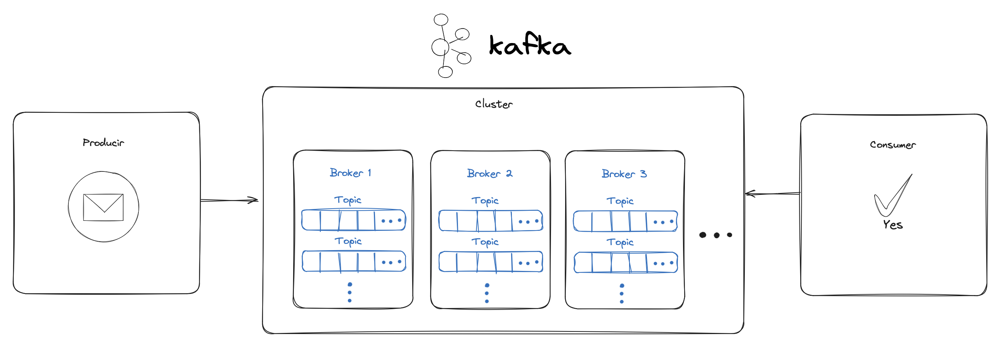
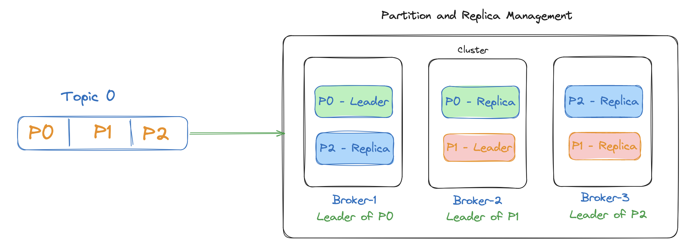

# Fundamentals of Apache Kafka:

## Index

- [Fundamentals of Apache Kafka:](#fundamentals-of-apache-kafka)
  - [Index](#index)
  - [1. Kafka's architecture](#1-kafkas-architecture)
  - [Producers:](#producers)
  - [Brokers:](#brokers)
    - [Message Storage:](#message-storage)
    - [Partition and Replica Management:](#partition-and-replica-management)
    - [Leaders and Followers Management:](#leaders-and-followers-management)
    - [Coordination and Load Balancing:](#coordination-and-load-balancing)
    - [State Management and Failures:](#state-management-and-failures)
  - [Consumers:](#consumers)
- [2. Instalación y Configuración de Kafka](#2-instalación-y-configuración-de-kafka)
- [3.Operations and Administration](#3operations-and-administration)
  - [1. Cluster Management](#1-cluster-management)
  - [2. Monitoring and Logging](#2-monitoring-and-logging)
  - [3. Security](#3-security)

## 1. Kafka's architecture

Apache Kafka is a distributed messaging platform designed to handle real-time data streams. Its basic architecture includes:

## Producers: 
Applications that send messages to Kafka.

## Brokers: 
Servers that form the core of Kafka and store data (messages).

A broker in Kafka is an instance of Kafka running the Kafka server software. 
A Kafka cluster is composed of one or more brokers that work together to distribute the load and provide high availability.

### Message Storage:
Each broker stores messages for the topics assigned to it. Messages are stored in partitions, which are storage and parallelism units.

Each partition of a topic is stored in one or more brokers.

### Partition and Replica Management:

Brokers manage topic partitions. A partition can be stored in multiple brokers as replicas to provide fault tolerance.
A partition has a leader broker and several followers. The leader handles all reads and writes to the partition, while the followers replicate the leader's data.

### Leaders and Followers Management:
* Partition Leader: Each partition has a leader broker that handles all read and write operations.

* Partition Replicas: Other brokers store replicas of the partition and act as followers, replicating the leader's data to provide redundancy.

### Coordination and Load Balancing:
The brokers work together to balance the workload. Apache Kafka automatically distributes partitions among the brokers to optimize performance and availability.

When a new broker is added to the cluster, partitions can be redistributed to balance the load.
        
### State Management and Failures:
Brokers monitor the status of the cluster and communicate with each other using ZooKeeper. If a broker fails, the partitions that were led by that broker will be reassigned to other brokers that have replicas of those partitions.
        
## Consumers:

Aplicaciones que reciben y procesan los mensajes almacenados en Kafka.

* Topics: Logical channels where messages are published. Producers send messages to a topic and consumers read from a topic.

* Partitions: Each topic can be divided into several partitions that are distributed among brokers to allow scaling and fault tolerance.

* Records: Unit of data that is sent from a producer to a topic and then consumed from a topic by a consumer.

# 2. Instalación y Configuración de Kafka

To install and configure Kafka:

    Local Installation: download and configure Kafka on your local machine for development and testing. [See docker-compose](./docker-compose.yml).

    Cloud Installation: Deploy Kafka in public cloud environments (e.g., AWS, Azure) using managed services or by deploying Kafka on virtual machines.

Configuring Kafka properly involves adjusting parameters such as broker settings, partition management, replication and security settings to suit your specific usage requirements.

# 3.Operations and Administration

## 1. Cluster Management

Administering a Kafka cluster involves managing and maintaining the infrastructure that supports the distributed messaging system:

    Broker Management: Add new brokers to scale horizontally or remove brokers to adjust to changes in load or hardware requirements.

    Partition Balancing: Distribute partitions among brokers evenly to improve performance and fault tolerance.

    Cluster Configuration: Adjust configuration parameters such as data retention, replication and log cleanup policy to optimize performance and storage capacity.

## 2. Monitoring and Logging

To ensure optimal operation and efficient troubleshooting, it is crucial to monitor and manage the performance of the Kafka cluster:

    Monitoring Tools: Use tools such as Prometheus, Grafana, Confluent Control Center, or native Kafka tools to monitor broker performance, message latency, and resource usage.

    Logging: Configure and manage logs for problem diagnosis, transaction tracking and event auditing in the Kafka cluster.

## 3. Security

Implementing security measures is essential to protect data and ensure authorized access to the Kafka cluster:

    Authentication: Use mechanisms such as SASL (Simple Authentication and Security Layer) to authenticate producers and consumers against the Kafka cluster.

    Authorization: Configure access control lists (ACLs) to limit which users and applications can read or write to specific topics in the cluster.

    Encryption: Enable SSL/TLS to encrypt communication between clients, brokers and other parts of the Kafka ecosystem, ensuring that data in transit is protected against unauthorized access.
